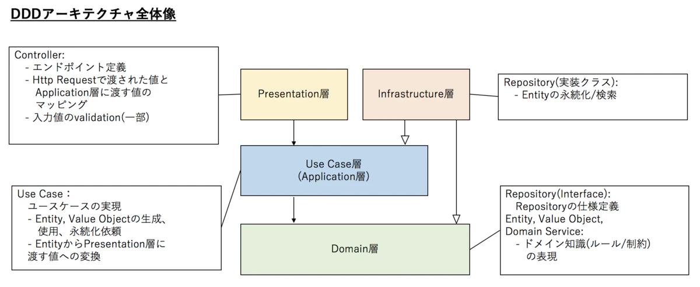

# DDD（ドメイン駆動設計）

> 現在の自分なりの理解をベースとして話を進めます。

## 全体構成



中心に普通のAPIを据えて、周囲を抽象化インターフェースで覆う設計思想。  
内向きへの依存に制限するため自然にオニオン構造となる。

```txt
IN -> ( Presentation -> ( UseCase -> ( Domain -> ) UseCase -> ) Presentation -> ) -> OUT
```

## 超要約 & 総評

説明が長くなるため先に超絶簡単にまとめて総評を出しておく。  
DDDはレイヤーが多く理解しずらいため単純化すると、要は下に表す2つのパッケージを組み合わせて1つのサービスを実現すると言うこと。

- ### Core SDK

  ```ドメイン層```  
  リソースへの関心。  
  シンプルで特に制限のないCRUDインターフェースを提供。  

- ### Presentation API

  ```プレゼンテーション層``` ```ユースケース層```  
  アプケーションへの関心。  
  Core SDKを使ってアプリケーションが求めるインターフェースを提供。  

### メリットの考察

- ドメイン層を隠匿する事によりスパゲティ化を抑制し、同時に変更（MySQL→NoSQL / スキーマ変更）に強い構造。
- 設計と実装を分離させやすくスキルによる分業がしやすい。
- ドメイン層が無くても（DB接続なしで）テストが可能なためカバレッジを上げやすい。
- 仕様書とユースケース層を対応させやすい。

### デメリットの考察

- 理解しずらくフレームワークとして守ってもらえない可能性が高い。次のセクションで記載するガチ解説をチーム全体がスッと理解できるとは到底思えないため、導入するには感覚的に扱えるようこちらで再度フレームワーク化する必要がある。この作業無しでチームに押し付けるのは明らかにリーダーのリスク管理不足だと私は思う。
- もし決まりが守られなかった場合、サービス内部でスパゲティ化が発生する。これは確実に発生する。
- 単純に抽象化の工数が上乗せになる。

### 総評

- 悪くはないし、腑に落ちる部分はあるが工数の膨らみをどう捉えるか。
- うちの場合は自然と単純化で示した2パッケージ構成になっていたため意識せずともリファクタで自然と寄っていく設計だと思うが、初回からこの工数でスタートするには慣れが必要。

## 各レイヤーの役割

### プレゼンテーション層

外部公開インターフェース。HTTP APIの場合は「HTTPルーター & リゾルバー」となる。  
HTTPリクエストを適切なメソッドにルーティングし、リクエストを対象の関数インプットに変換して入力。  
レスポンスが返ったら再度HTTP形式に変換して出力する。

> 要するに express 等軽量ルーターが担当する範囲

↓

### ユースケース層

ビジネスロジックに合わせたインターフェースを提供する。（アクションを生やす）  
ここから直接DBへの永続化はせず、次に書くドメイン層のインターフェースを介してDB操作をする。

> 要するにコントローラー

↓

### ドメイン層

制限の無いシンプルな CRUD + α インターフェースを提供する。  
ここでリソースに直接アクセスしてデータの永続化を行う。

> 要するにここがLaravelで言うModel + Controller、または自動生成のGraphQLに相当する。

EX.

### モデル（ユースケース層用）

ユースケース層で使用するモデルはリソース接続せず、ドメイン層のインターフェースを介して永続化処理をする。  
ややこしいので独自に「アクション・モデル」としておく。  
ドメイン層で扱う方が一般的なModel。こちらは「リソース・モデル」と別名を命名しておく。

### インフラ層

ここにユースケース層とドメイン層の実装を書いて注入するらしい。  
ユースケース層とドメイン層はインターフェイスデザイナー（設計者）に任せ、実装はコーダーにまとめて投げられる構成と言うことだろう。面倒だが、大きなプロジェクトで破綻しない業務フローとしては納得できる。

> 要するに実装関数置き場
